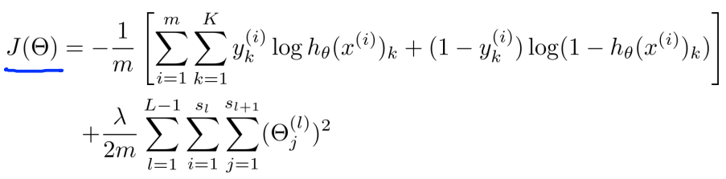
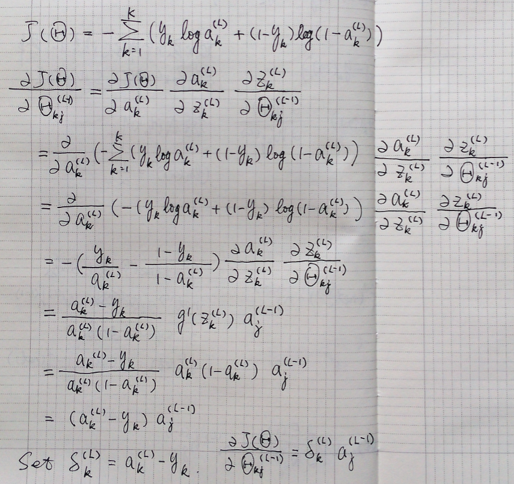

# neural-networks-partial-derivative

In coursera 《Machine Learning》neural network course, the cost function is set like this for classification problem:

But cost function in some books are set as square error when take the partial derivative calculation. So that make the δ difference from the log error.
So try to calculate the partial derivative for the log error cost function.

For simplicity, let J take only one training sample, and ignore the regularization item.
Here only calculate the partial derivative respect to the Θ of L-1 layer.(connect L-1 layer to L layer).

J: cost function
Θ: parameters of neural networks
K: number of unit in output layer
y: real output of sample
a: output of neural networks units
z: input of neural networks units
L, L-1: L is the output layer, L-1 is the layer before the output layer
k: the kth unit of output layer
j: the jth unit of L-1 layer

activation function: a = g(z), g is sigmoid function

